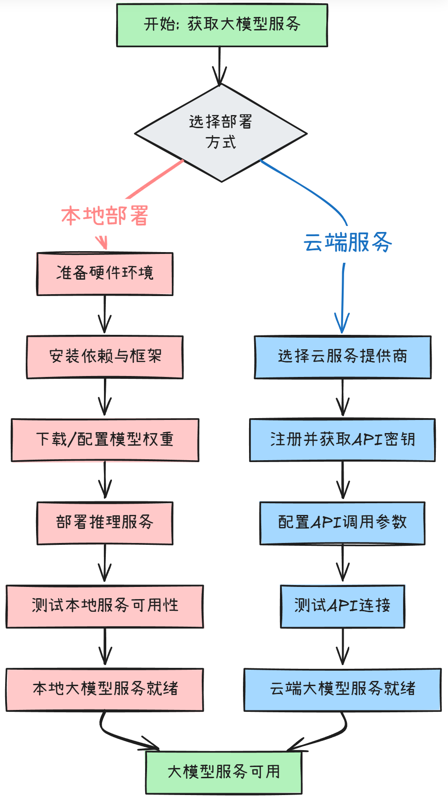

# 大模型应用开发

## 一、导言

在短时间内掌握前沿 AI 应用技术，从传统开发者转型为下一代智能系统构建者

1. （是什么）大模型、Prompt、RAG、多模态、Function Calling、MCP，你想要的前沿知识这里都有！

2. （为什么要做）大模型应用开发能带来什么？

3. （怎么做）只有python才能干AI？Java完全没问题！架构设计+完整实践，干货统统奉上！

   

## 二、理论基础

### （是什么）大模型应用技术脉络，通俗易懂

```
（大模型是怎么来的可以自行去了解，这里侧重关心基于大模型的能力去升级应用的能力）

1. 传统应用："从已有的数据中找到想要的内容"

2. 大模型（Model）：一颗聪明的大脑，能够理解和生成人类语言，"根据提示生成可能的内容"

3. 提示词（Prompt）：，通过预设或者用户每次发送的内容作为大模型的输入，影响生成内容走向

4. 嵌入（Embeddings）：将文本、图像视频等用数字表示，转换成向量

5. 令牌（token）：输入给模型的内容会先转为token，输出也是由token转为内容。（在英语中，一个标记大约相当于一个单词的 75%。作为参考，莎士比亚全集总计约 900,000 字，翻译成大约 120 万个token）

6. 记忆（Memory）：模型虽然聪明，但本身不具备记忆功能

6. 检索增强生成（RAG）：以更低成本的方式，帮助大模型生成更高质量（知识量、知识时效）的回答

7. 多模态（Multimodality）：帮助大模型具备读懂和生成更丰富内容的能力，如图片、音视频等

8. 工具调用（Function tool）：帮助大模型 从 "说出来" 到 "动起来"

9. 模型上下文协议（MCP）：统一的方式，让大模型“动起来”

在大模型的应用开发领域，一步步走来，大模型从最开始的“聪明大脑”变成一个能说会道、有记忆、可以学习新知识且能做实事的“智能体”
```

### （为什么要做）大模型应用开发的价值

```
Agent即智能体
让大模型“代理/模拟”「人」的行为，使用某些“工具/功能”来完成某些“任务”

Agent能做的事情，在Agent出现之前其实就能做

能带来的好处是什么呢？
1.降低应用开发门槛：无论是写代码、剪辑、还是音视频创作等
2.简化流程复杂度：区别于传统开发严丝合缝的流程编排，通过大模型强大的理解能力大大的降低流程的构建复杂度
3.交互方式多样性：agent不局限于自然语言交互，还有多种比如图形界面和动作执行的交互（比如代理操作浏览器）
4.协同完成复杂任务，多个不同的agent进行 组装、协同、竞争，共同参与决策进行合作，达到更好的效果

不像是传统系统各方面最佳实践已经成型，目前使用大模型构建Agent诸多挑战，如响应速度慢、幻觉和纯文本交互不优友好等
1.提升响应速度：芯片提升、模型参数裁剪、模型蒸馏、输入内容预处理（文档切块、Prompt压缩等）
2.降低幻觉：引导Prompt规范书写、慢思考、GraphRAG、Agent预编译
3.其他
```


### （怎么做）如何进行大模型应用开发

如何实现上面一步步，让大模型成为“智能体”呢？

1. 大模型服务：通过本地部署/云端获取大模型服务
   <details>
    <summary>点击查看图片</summary>
    
   </details>
   
   
2. 对话
   <details>
    <summary>点击查看图片</summary>
    
   </details>
   
   
3. 日志
   <details>
    <summary>点击查看图片</summary>
    
   </details>


4. 记忆
   <details>
    <summary>点击查看图片</summary>
    
   </details>


5. 提示词工程
   <details>
    <summary>点击查看图片</summary>
    
   </details>


6. RAG
   <details>
    <summary>点击查看图片</summary>
    
   </details>


7. 多模态
   <details>
    <summary>点击查看图片</summary>
    
   </details>


8. Function Calling
   <details>
    <summary>点击查看图片</summary>
    
   </details>


9. MCP
   <details>
    <summary>点击查看图片</summary>
    
   </details>
   
   
10. 系统评估与优化
   <details>
    <summary>点击查看图片</summary>
    
   </details>


## 三、实践


