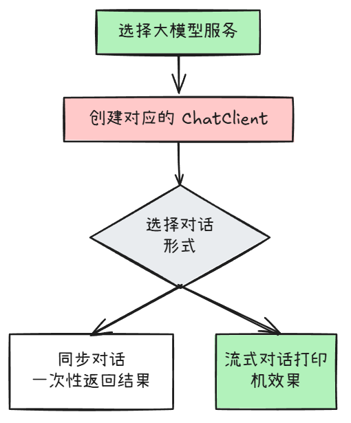
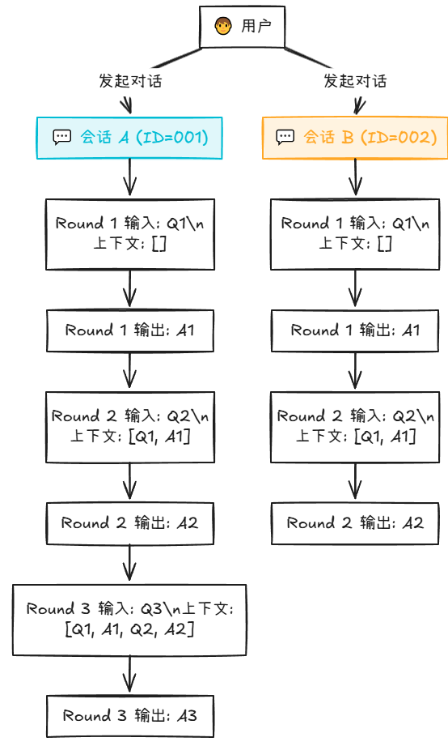
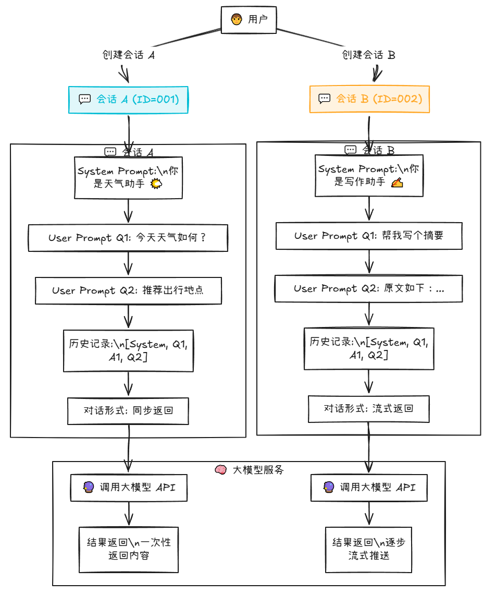
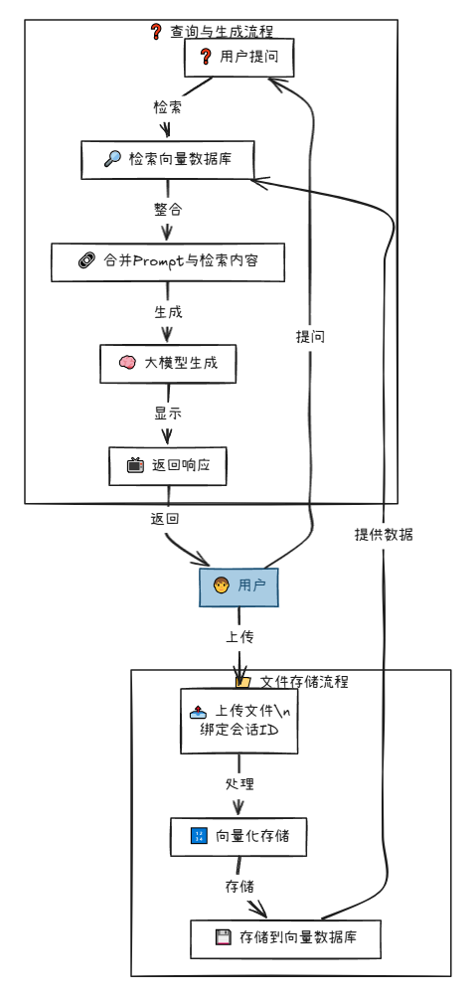
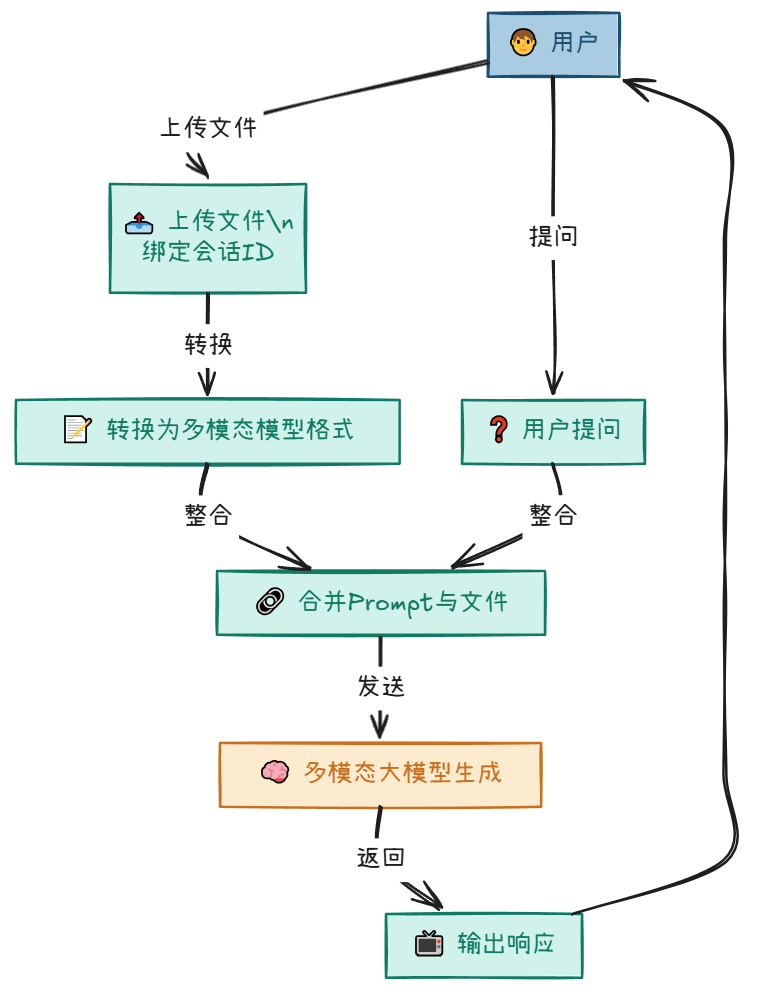
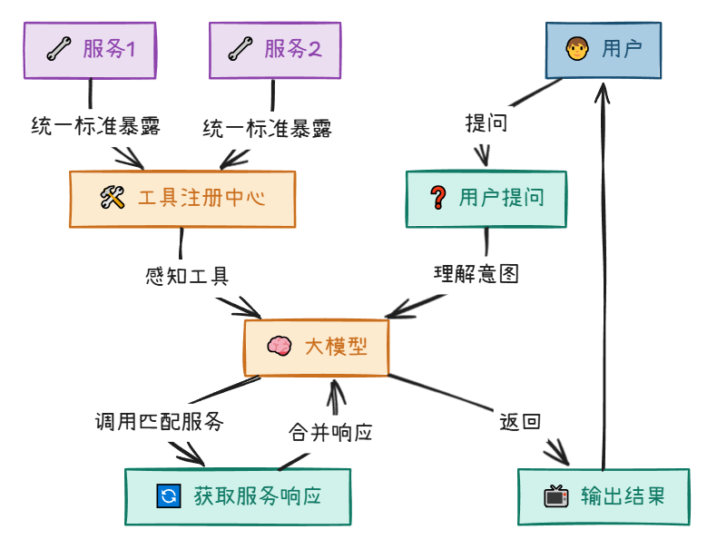

# 大模型应用开发

## 一、导言

在短时间内掌握前沿 AI 应用技术，从传统开发者转型为下一代智能系统构建者

1. （是什么）大模型、Prompt、RAG、多模态、Function Calling、MCP，你想要的前沿知识这里都有！

2. （为什么要做）大模型应用开发能带来什么？

3. （怎么做）只有python才能干AI？Java完全没问题！架构设计+完整实践，干货统统奉上！

   

## 二、理论基础

### （是什么）大模型应用技术脉络，通俗易懂

```
（大模型是怎么来的可以自行去了解，这里侧重关心基于大模型的能力去升级应用的能力）

1. 传统应用："从已有的数据中找到想要的内容"

2. 大模型（Model）：一颗聪明的大脑，能够理解和生成人类语言，"根据提示生成可能的内容"

3. 提示词（Prompt）：，通过预设或者用户每次发送的内容作为大模型的输入，影响生成内容走向

4. 嵌入（Embeddings）：将文本、图像视频等用数字表示，转换成向量

5. 令牌（token）：输入给模型的内容会先转为token，输出也是由token转为内容。（在英语中，一个标记大约相当于一个单词的 75%。作为参考，莎士比亚全集总计约 900,000 字，翻译成大约 120 万个token）

6. 记忆（Memory）：模型虽然聪明，但本身不具备记忆功能

6. 检索增强生成（RAG）：以更低成本的方式，帮助大模型生成更高质量（知识量、知识时效）的回答

7. 多模态（Multimodality）：帮助大模型具备读懂和生成更丰富内容的能力，如图片、音视频等

8. 工具调用（Function tool）：帮助大模型 从 "说出来" 到 "动起来"

9. 模型上下文协议（MCP）：统一的方式，让大模型"动起来"

在大模型的应用开发领域，一步步走来，大模型从最开始的"聪明大脑"变成一个能说会道、有记忆、可以学习新知识且能做实事的"智能体"
```

### （为什么要做）大模型应用开发的价值

```
Agent即智能体
让大模型"代理/模拟"「人」的行为，使用某些"工具/功能"来完成某些"任务"

Agent能做的事情，在Agent出现之前其实就能做

能带来的好处是什么呢？
1.降低应用开发门槛：无论是写代码、剪辑、还是音视频创作等
2.简化流程复杂度：区别于传统开发严丝合缝的流程编排，通过大模型强大的理解能力大大的降低流程的构建复杂度
3.交互方式多样性：agent不局限于自然语言交互，还有多种比如图形界面和动作执行的交互（比如代理操作浏览器）
4.协同完成复杂任务，多个不同的agent进行 组装、协同、竞争，共同参与决策进行合作，达到更好的效果

不像是传统系统各方面最佳实践已经成型，目前使用大模型构建Agent诸多挑战，如响应速度慢、幻觉和纯文本交互不优友好等
1.提升响应速度：芯片提升、模型参数裁剪、模型蒸馏、输入内容预处理（文档切块、Prompt压缩等）
2.降低幻觉：引导Prompt规范书写、慢思考、GraphRAG、Agent预编译
3.其他
```

### （怎么做）大模型应用开发架构设计

1. 获取大模型服务

   两条路，云服务（花钱买）或者自己部署

   

   

2. 创建会话

   根据对应的大模型服务，创建对应的对话客户端（ChatClient），对话有两种形式，同步（一次性全部返回结果）和流式（打印机效果）

   

3. 会话记忆

   每次新的对话，将之前的对话ID（会话隔离）和聊天历史（会话记忆）再附上即可

   

4. 提示词工程

   提示词分为系统提示词（模型的角色设定）和用户提示词（用户的提问内容）

   

5. RAG

   将用户上传的文件向量化存储在向量数据库，搜索时优先检索向量数据库，然后将 “文件检索内容”+“用户提示词”一起发给大模型，拿到响应结果

   

6. 多模态

   用户上传的文件转成大模型能够识别的“文件”，跟随对话发送给大模型（模型需要支持多模态）即可



7. Function calling

   传统的接口提供给大模型，对话时，大模型就可以根据用户的意图去间接调用这些服务接口，拿到响应后结合用户的提示词响应最终的结果

   


8. MCP

​	每个“服务”都可以把自己的服务，按照统一的标准暴露出去，让大模型去感知，大模型就可以通过理解用户意图，去调用对应的服务




## 三、实践

### 1. 项目结构设计

   ```
xiaoxingbomei-back/
├── llm-common/          # 公共模块（不用来运行，提供一些公共依赖、工具类和实体）
├── llm-server/          # AI服务端（MCP Server，作为我们实践全部大模型应用的服务）
├── llm-client/          # mcp客户端（模拟客户端去调用mcp服务）
└── file/SQL             # 初始化的一些sql，ddl和dml，部署记得用

   ```

### 2. 核心实现代码

